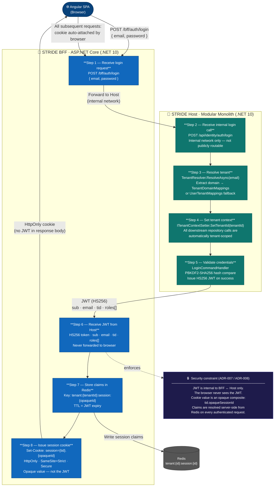

# STRIDE — Authentication Flow Diagram

**Story:** US-038 | **Epic:** EP-017 | **Milestone:** Docs and Diagrams
**Trigger:** End of Phase 1 (retroactive — scaffold complete as of 2026-05-14)

> This diagram traces the full login sequence from browser to BFF to Host and back.
> It explains where the JWT lives, why the browser never sees it, and how the opaque session
> cookie is constructed. The tenant resolution step is expanded in the
> [Tenant Resolution Diagram (US-039)](tenant-resolution.md).

---

---

## Key Design Decisions Reflected

| Decision | What the diagram shows |
|---|---|
| BFF pattern (ADR-007) | Host API endpoint is internal-only; SPA has no direct route to it |
| JWT never reaches browser (ADR-008) | B2 receives the JWT; B4 sends only an opaque cookie — no `Authorization` header, no `localStorage` |
| Opaque session cookie | Cookie value `{tid}.{opaqueSessionId}` — not decodable by the browser; claims live in Redis |
| Redis session store | B3 writes `tenant:{tenantId}:session:{opaqueId}` → full claims JSON; TTL matches JWT expiry |
| HS256 symmetric JWT (internal) | JWT is signed with a shared secret — used only for BFF↔Host trust, never exposed externally |
| PBKDF2-SHA256 password hashing | H4 compares the stored hash — no plaintext passwords at rest |
| Cookie flags | `HttpOnly` (no JS access) · `SameSite=Strict` (no CSRF) · `Secure` (HTTPS only) |

---

## Login Flow — Step by Step

| Step | Actor | Action |
|---|---|---|
| 1 | BFF | Receives `POST /bff/auth/login { email, password }` from Angular SPA |
| 2 | Host | Receives forwarded login request on internal-only `POST /api/identity/auth/login` |
| 3 | Host — Identity | `TenantResolver.ResolveAsync(email)` — extracts domain, queries `TenantDomainMappings`, falls back to `UserTenantMappings` |
| 4 | Host — Identity | `ITenantContextSetter.SetTenantId(tenantId)` — all downstream DB calls now auto-filter by this TenantId |
| 5 | Host — Identity | `LoginCommandHandler` — PBKDF2-SHA256 credential check; issues HS256 JWT on success |
| 6 | BFF | Receives JWT (`sub`, `email`, `tid`, `roles[]`); JWT is never forwarded to the browser |
| 7 | BFF | Writes decoded claims to Redis at `tenant:{tenantId}:session:{opaqueId}`, TTL = JWT expiry |
| 8 | BFF | Issues `Set-Cookie: session={tid}.{opaqueId}` with `HttpOnly`, `SameSite=Strict`, `Secure` flags |
| — | Browser | Stores cookie; auto-attaches it on every subsequent HTTPS request to the BFF |

---

## Subsequent Request Handling

On every authenticated request after login:

1. Browser auto-attaches the `session` cookie (no JS involvement — `HttpOnly`).
2. BFF middleware parses `tid.opaqueSessionId` from the cookie.
3. BFF looks up `tenant:{tid}:session:{opaqueId}` in Redis to hydrate claims.
4. If the key is missing (expired or revoked), the request is rejected with `401 Unauthorized`.
5. Claims (`sub`, `email`, `tid`, `roles[]`) are forwarded in an internal header to the Host.

---

*Source file: [`auth-flow.mmd`](auth-flow.mmd) | PNG: [`auth-flow.png`](auth-flow.png)*
*Last updated: 2026-05-16 | Next update trigger: external IdP integration (Phase 6+) or session revocation flow added*
