```mermaid
flowchart LR
    classDef person    fill:#08427B,stroke:#052E56,color:#fff,font-size:13px
    classDef container fill:#1168BD,stroke:#0B4884,color:#fff,font-size:13px
    classDef module    fill:#1558A0,stroke:#0D3B6E,color:#fff,font-size:12px
    classDef db        fill:#555555,stroke:#333,color:#fff,font-size:12px
    classDef extSystem fill:#999999,stroke:#6b6b6b,color:#fff,font-size:12px

    subgraph USERS["👤  Users"]
        direction TB
        USR("**Tenant Admin**\n─────────────\nOperations Manager\nField Worker\nFinance User")
    end

    subgraph BROWSER["🌐  Browser"]
        direction TB
        SPA("**Angular SPA**\n─────────────\nAngular 21 · TypeScript\nTailwind CSS 4 · PrimeNG 21\nSignals + RxJS\n─────────────\nBFF-only calls.\nNo bearer tokens\nor direct Host API access.")
    end

    subgraph BFFBOX["🔷  STRIDE BFF  ·  ASP.NET Core (.NET 10)"]
        direction TB
        AUTHM("**Cookie Auth**\n─────────────\nHttpOnly · SameSite=Strict\nIssues opaque session cookie.\nJWT never forwarded to client.")
        SESS("**Session Handler**\n─────────────\nRedis-backed store.\nKey: tenant:{id}:session:{id}\nTTL matches JWT expiry.")
        PROXY("**BFF Proxy**\n─────────────\nTyped HttpClient → Host.\n/bff/auth/*\n/bff/workflows/*\n/bff/reporting/*")
    end

    subgraph HOSTBOX["🔷  STRIDE Host  ·  Modular Monolith (.NET 10)"]
        direction TB
        BB("**BuildingBlocks**\n─────────────\nResult‹T› · ITenantContext\nICurrentUser · IEventBus\nTenantAwareRepository‹T›\nIDomainEvent · AuditableEntity")
        PIPE("**MediatR Pipeline**\n─────────────\nValidationBehaviour\nLoggingBehaviour\nTenantBehaviour")
        subgraph MODS["Feature Modules  (each: Domain / Application / Infrastructure / API)"]
            direction TB
            IDENTITY("**Identity**\nUser · Role · Permission\nJWT · Tenant resolver")
            WORKFLOWS("**Workflows**\nDefinition · Instance · Steps\nState machine · CRUD lifecycle")
            OTHER("**Scheduling** (Ph.5)\n**Notifications** (Ph.5)\n**Reporting** · **Invoicing** (Ph.6)\n**Administration**")
        end
    end

    subgraph DATA["☁️  Data Stores"]
        direction TB
        SQL[("**Azure SQL**\n─────────────\nShared DB + TenantId isolation.\nSchema-separated per module:\nidentity.* · workflows.*\nscheduling.* · reporting.*")]
        REDIS[("**Redis**\n─────────────\nBFF: session store\nHost: cache + revocation\nKey: tenant:{id}:session:{id}")]
    end

    subgraph EXT["☁️  External  (Future Phases)"]
        direction TB
        MAIL("**Email Service**\nSMTP / SendGrid\n(Phase 5)")
        IDP("**External IdP**\nAzure AD / Auth0 / OIDC\n(Phase 6+)")
    end

    USR -- "HTTPS / Browser" --> SPA
    SPA -- "HTTPS +\nHttpOnly Cookie" --> BFFBOX
    BFFBOX -- "HTTPS /\nTyped HttpClient" --> HOSTBOX
    BFFBOX -- "Session store\nTLS" --> REDIS
    HOSTBOX -- "EF Core writes\nDapper reads / TLS" --> SQL
    HOSTBOX -- "Cache + revoke\nTLS" --> REDIS
    HOSTBOX -. "SMTP (Phase 5)" .-> MAIL
    HOSTBOX -. "OIDC / SAML (Phase 6+)" .-> IDP

    class USR person
    class SPA,AUTHM,SESS,PROXY,BB,PIPE,IDENTITY,WORKFLOWS,OTHER container
    class SQL,REDIS db
    class MAIL,IDP extSystem
```

# STRIDE — Container Diagram (C4 Level 2)

**Story:** US-036 | **Epic:** EP-017 | **Milestone:** Docs and Diagrams
**Trigger:** End of Phase 1 (retroactive — scaffold complete as of 2026-05-14)

> This diagram zooms into the STRIDE platform boundary from the [System Context Diagram (US-035)](system-context.md)
> and shows each deployable container, the technology choice behind each one, and how they communicate.
> Internal module detail is deferred to the [Module Interaction Diagram (US-037)](module-interaction.md).

---

---

## Key Design Decisions Reflected

| Decision | What the diagram shows |
|---|---|
| BFF pattern (ADR-007, ADR-008) | SPA calls only the BFF — never directly to the Host API |
| HttpOnly opaque session cookie | Cookie Auth container issues `tid.opaqueSessionId`; JWT stays inside BFF↔Host only |
| Redis session store | BFF Session Handler writes claims; Host can independently revoke via the same key pattern |
| Modular monolith (ADR-001) | One Host process — BuildingBlocks shared kernel + feature modules + MediatR pipeline |
| Shared DB + TenantId isolation (ADR-006) | Single Azure SQL instance, schema-separated (`identity.*`, `workflows.*`, etc.) |
| EF Core writes / Dapper reads | CQRS read/write split at the infrastructure layer — EF for writes, Dapper for fast read models |
| Future-ready IdP (Phase 6+) | External IdP shown as dashed future integration |

---

## Containers

| Container | Technology | Responsibility |
|---|---|---|
| Angular SPA | Angular 21, TypeScript, Tailwind CSS 4, PrimeNG 21 | All user-facing UI; communicates exclusively with BFF via HttpOnly cookie |
| STRIDE BFF | ASP.NET Core (.NET 10) | Translates SPA requests → Host calls; manages sessions in Redis; never exposes JWT to browser |
| Cookie Auth | ASP.NET Core Cookie Middleware | Issues and validates the opaque `tid.opaqueSessionId` session cookie |
| Session Handler | StackExchange.Redis | Stores decoded JWT claims in Redis; key: `tenant:{id}:session:{id}`, TTL = JWT expiry |
| BFF Proxy | Typed `HttpClient` | Routes BFF endpoints to corresponding Host endpoints on the internal network |
| STRIDE Host | ASP.NET Core (.NET 10), Modular Monolith | All business logic; issues HS256 JWTs to BFF only; auto-scopes every query to TenantId |
| BuildingBlocks | Shared class library | Cross-cutting abstractions: `Result<T>`, `ITenantContext`, `TenantAwareRepository<T>`, domain primitives |
| MediatR Pipeline | MediatR 12 + FluentValidation | Validation, logging (Serilog + CorrelationId), and TenantContext hydration on every command/query |
| Feature Modules | Per-module assemblies | Domain isolation — each owns its own Domain / Application / Infrastructure / API layers |
| Azure SQL | Azure SQL Database | Persistent relational store; TenantId column on every tenant-scoped table |
| Redis | Azure Cache for Redis | BFF session store + Host cache and JWT revocation list |

---

*Source file: [`container.mmd`](container.mmd) | PNG: [`container.png`](container.png)*
*Last updated: 2026-05-16 | Next update trigger: Phase 2 completion or new container added*
