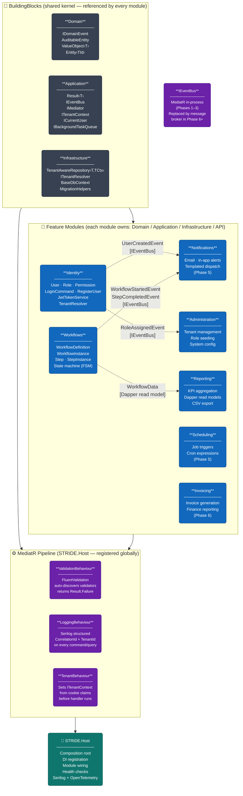

# STRIDE — Module Interaction Diagram

**Story:** US-037 | **Epic:** EP-017 | **Milestone:** Docs and Diagrams
**Trigger:** End of Phase 1 (retroactive — scaffold complete as of 2026-05-14)

> This diagram shows how the internal layers of the STRIDE Host relate to one another:
> the shared BuildingBlocks kernel, the seven feature modules, the MediatR pipeline behaviours,
> and the cross-module domain event flows.
> For the full login sequence, see the [Auth Flow Diagram (US-038)](auth-flow.md).

---

---

## Key Design Decisions Reflected

| Decision | What the diagram shows |
|---|---|
| Modular monolith (ADR-001) | Seven feature modules in a single Host process — each module owns its full vertical slice |
| Shared kernel (BuildingBlocks) | Every module references BuildingBlocks; no module references another module directly |
| MediatR pipeline (ADR-003) | All commands and queries flow through Validation → Logging → TenantBehaviour before reaching handlers |
| In-process event bus (Phases 1–3) | Domain events flow via `IEventBus` (MediatR `Publish`) — note indicates Phase 6+ replacement |
| TenantAwareRepository (ADR-006) | BBI layer: `TenantAwareRepository<T,TCtx>` auto-applies `WHERE TenantId = @tid` on every query |
| Dapper for read models | Reporting module uses Dapper directly — bypasses EF change tracking for high-performance aggregations |
| Result‹T› pattern | Application layer: no exceptions for domain errors — all handlers return `Result<T>` |

---

## BuildingBlocks Layers

| Layer | Key Types | Purpose |
|---|---|---|
| Domain | `IDomainEvent`, `AuditableEntity`, `ValueObject<T>`, `Entity<TId>` | Primitive building blocks for all domain entities and events |
| Application | `Result<T>`, `IEventBus`, `IMediator`, `ITenantContext`, `ICurrentUser`, `IBackgroundTaskQueue` | Cross-cutting application-layer contracts — no infrastructure dependencies |
| Infrastructure | `TenantAwareRepository<T,TCtx>`, `ITenantResolver`, `BaseDbContext`, `MigrationHelpers` | Shared EF Core base classes; multi-tenant filtering applied once, inherited everywhere |

---

## Domain Event Flows

| Producer | Event | Consumer | Trigger |
|---|---|---|---|
| Identity | `UserCreatedEvent` | Notifications | Welcome email on first registration |
| Identity | `RoleAssignedEvent` | Administration | Audit log entry on role change |
| Workflows | `WorkflowStartedEvent` | Notifications | Alert assigned users on workflow activation |
| Workflows | `StepCompletedEvent` | Notifications | Alert next assignee when a step is completed |
| Workflows | Dapper read model query | Reporting | KPI aggregation over workflow data |

---

## MediatR Pipeline Order

Every command and query registered in the Host passes through behaviours in this order:

1. **TenantBehaviour** — Resolves `ITenantContext` from the session cookie claims and sets `TenantId` before any handler logic runs. All downstream `TenantAwareRepository<T>` calls are automatically scoped.
2. **ValidationBehaviour** — Runs all FluentValidation validators auto-discovered for the request type. Returns `Result.Failure` with a validation error list without invoking the handler.
3. **LoggingBehaviour** — Logs the command/query name, `CorrelationId`, and `TenantId` via Serilog structured logging. Measures handler duration.

---

*Source file: [`module-interaction.mmd`](module-interaction.mmd) | PNG: [`module-interaction.png`](module-interaction.png)*
*Last updated: 2026-05-16 | Next update trigger: new module added or IEventBus replaced with message broker*
