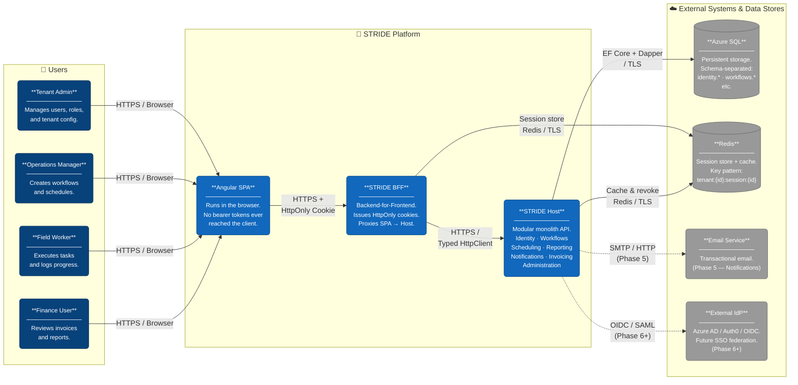

# STRIDE — System Context Diagram (C4 Level 1)

**Story:** US-035 | **Epic:** EP-017 | **Milestone:** Docs and Diagrams
**Trigger:** End of Phase 1 (retroactive — scaffold complete as of 2026-05-14)

> This diagram shows the top-level boundary of the STRIDE platform, the human users who interact with it,
> and the external systems it depends on or integrates with. Internal module detail is deferred to the
> [Container Diagram (US-036)](container.md).

---

---

## Key Design Decisions Reflected

| Decision | What the diagram shows |
|---|---|
| BFF pattern (ADR-007, ADR-008) | Angular SPA only talks to BFF — never directly to Host |
| HttpOnly cookie auth | Relationship label: "HTTPS + HttpOnly Cookie" — no token in browser |
| Modular monolith (ADR-001) | Host is a single deployable boundary containing all 7 modules |
| Shared DB + TenantId isolation (ADR-006) | One Azure SQL instance, schema-separated — not per-tenant databases |
| Redis session store (ADR-007) | BFF and Host both connect — BFF stores sessions, Host can revoke |
| Future-ready IdP (Auth Architecture) | External IdP shown as Phase 6+ dashed integration |
| Schema separation (ADR-012) | Azure SQL note: `identity.*, workflows.*, etc.` |

---

## Actors

| Actor | Role in STRIDE |
|---|---|
| Tenant Admin | Full platform admin within their tenant — manages users, roles, tenant settings |
| Operations Manager | Creates/manages workflows, assigns tasks, oversees scheduling |
| Field Worker | Executes tasks in the field; logs status updates and completions |
| Finance User | Read-only access to invoicing and financial reports |

---

*Source file: [`system-context.mmd`](system-context.mmd) | PNG: [`system-context.png`](system-context.png)*
*Last updated: 2026-05-15 | Next update trigger: Phase 2 completion (add auth detail → Container Diagram)*
