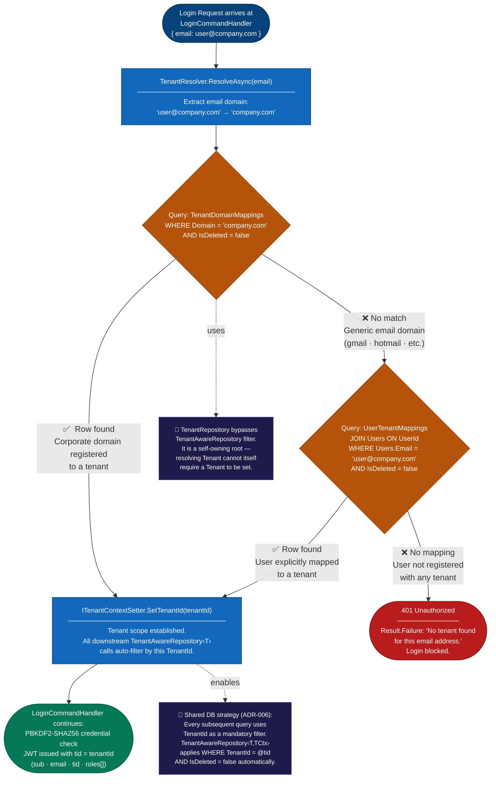

# STRIDE — Tenant Resolution Diagram

**Story:** US-039 | **Epic:** EP-017 | **Milestone:** Docs and Diagrams
**Trigger:** End of Phase 1 (retroactive — scaffold complete as of 2026-05-14)

> This diagram expands Step 3 of the [Auth Flow Diagram (US-038)](auth-flow.md) —
> the `TenantResolver.ResolveAsync(email)` call inside the STRIDE Host.
> It shows how the system determines which tenant a user belongs to
> before credential validation begins.

---



---

## Key Design Decisions Reflected

| Decision | What the diagram shows |
|---|---|
| Two-path tenant resolution | Domain lookup first (fast, covers corporate accounts); user-level mapping as fallback (covers personal/generic email domains) |
| Soft-delete filtering | Both queries include `AND IsDeleted = false` — deactivated domain mappings stop working immediately |
| TenantRepository bootstrap exception (ADR-006) | `TenantRepository` does **not** extend `TenantAwareRepository<T>` — it would be circular; it queries the `Tenants` table directly |
| No tenant = no login | If neither path resolves a tenant, the request fails with `401` before credentials are ever checked |
| `ITenantContextSetter` | Setting the TenantId on the ambient context automatically scopes all downstream `TenantAwareRepository<T>` queries — no need to pass TenantId as a parameter through every call |
| Shared DB isolation (ADR-006) | Once TenantId is set, `TenantAwareRepository<T,TCtx>` appends `WHERE TenantId = @tid AND IsDeleted = false` to every query automatically |

---

## Resolution Paths

### Path 1 — Corporate Domain Lookup
Used when the user's email domain is registered to a tenant (e.g. `@acme-corp.com`).

1. Extract domain from email: `user@acme-corp.com` → `acme-corp.com`
2. Query `TenantDomainMappings WHERE Domain = 'acme-corp.com' AND IsDeleted = false`
3. If a row is found → tenant identified; proceed to `ITenantContextSetter.SetTenantId`

### Path 2 — Explicit User Mapping (Fallback)
Used when the domain is a generic provider (e.g. `@gmail.com`, `@hotmail.com`) that is not registered as a corporate domain.

1. Query `UserTenantMappings JOIN Users ON UserId WHERE Users.Email = 'user@gmail.com' AND IsDeleted = false`
2. If a row is found → tenant identified; proceed to `ITenantContextSetter.SetTenantId`
3. If no row is found → `Result.Failure("No tenant found for this email address.")` → `401 Unauthorized`

---

## Why TenantRepository Is Special

Every other repository in STRIDE extends `TenantAwareRepository<T, TCtx>`, which automatically applies:
```sql
WHERE TenantId = @currentTenantId AND IsDeleted = false
```
`TenantRepository` **cannot** do this — it is the mechanism that *establishes* the TenantId in the first place.
If it required a TenantId to query, it would be an unresolvable bootstrap dependency.

`TenantRepository` therefore queries the `Tenants` table directly, with no ambient tenant filter.
All other repositories safely assume the filter is already applied.

---

*Source file: [`tenant-resolution.mmd`](tenant-resolution.mmd) | PNG: [`tenant-resolution.png`](tenant-resolution.png)*
*Last updated: 2026-05-16 | Next update trigger: external IdP tenant federation added (Phase 6+)*
